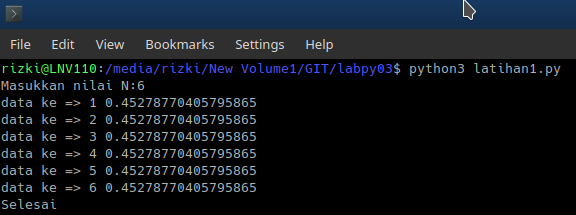
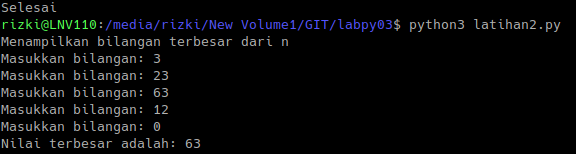
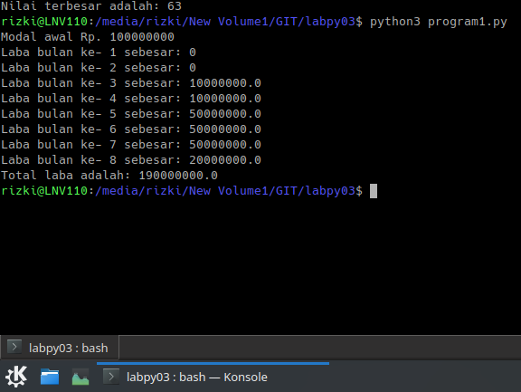

# 
.::Penjelasan Program::. 

<strong>Penjelasan latihan1</strong>
1. Anda akan diminta memasukan nilai input untuk N, banyak nya data yang akan di tampilkan berdasarkan input yang anda masukan. 
Anda bisa memasukan nilai input N berapa saja.
2. Akan muncul nilai 1 s/d N, yan merupakan perulangan penambahan dari 0+1.
3. Dengan menggunakan fungsi random. Yakni, program akan menampikan
angka dibawah 0.5 secara acak. 
3. Ketika anda sudah memberikan input nilai, maka akan langsung muncul 
data nilai random.

Screenshot latihan1

<strong>Penjelasan latihan2</strong>
1. Masukkan input bilangan
2. Program akan terus mengulang untuk meminta anda memasukkan bilangan, hinggan program berhenti ketika anda memasukan angka 0 (nol).
3. Program akan mencari bilangan terbesar dari beberapa bilangan yang anda inputkan.
4. Lalu akan ditampilkan bilangan terbesar dari semua bilangan yang anda 
input. 

Screenshot latihan2

<strong>Penjelasan program1</strong>

1. Modal awal pengusaha sebesar 100000000
2. Untuk menghitung laba perbulan maka diinputkan besarnya presentase keuntungan perbulan, yakni:
- Bulan pertama 0% (belum mendapat laba)
- Bulan ketiga 1%
- Bulan kelima 5%
- Bulan kelima 3%
3. Selanjutnya, hasil laba dari bulan perbulan akan ditampilkan. 
4. Program akan jumlahkan semua keuntungan yang didapat.
5. Maka akan ditampilkan total laba yang didapat.

Screenshot program1 

